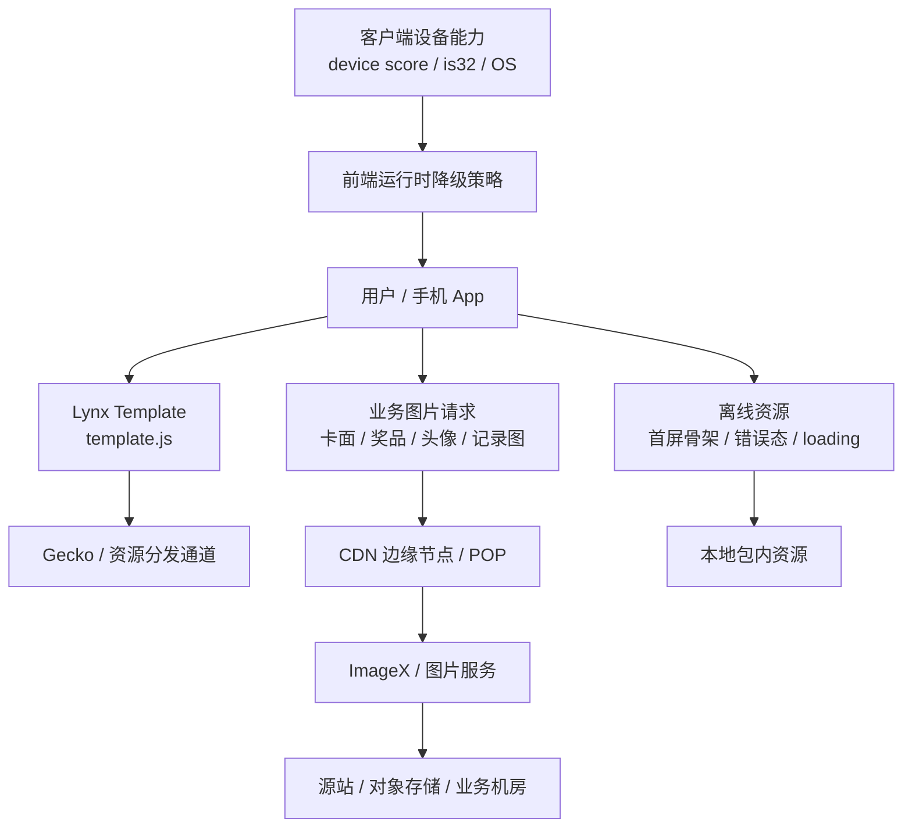
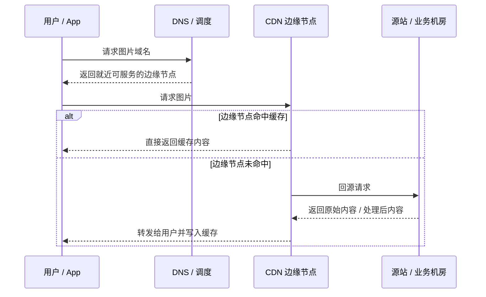
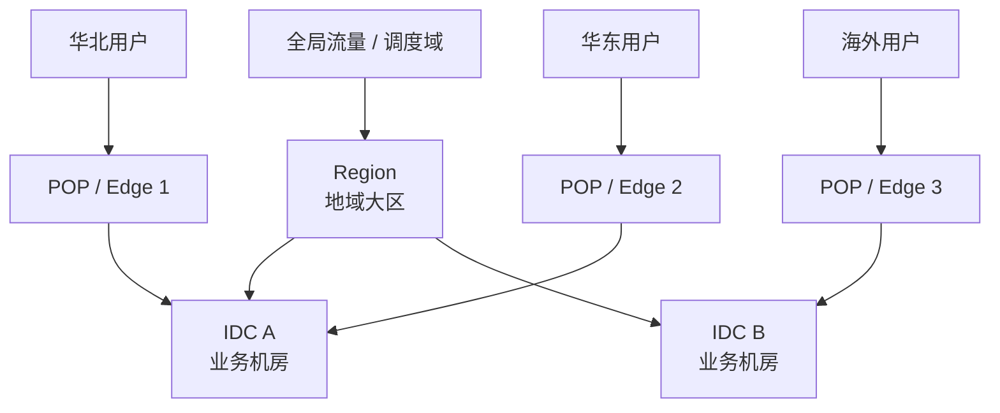
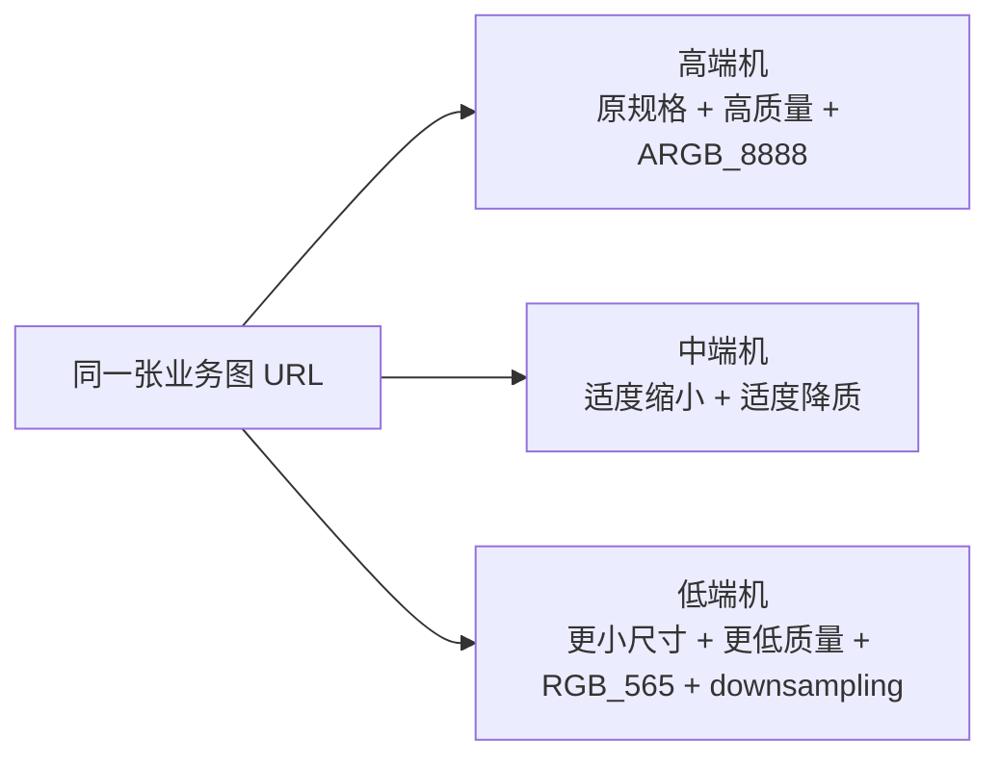
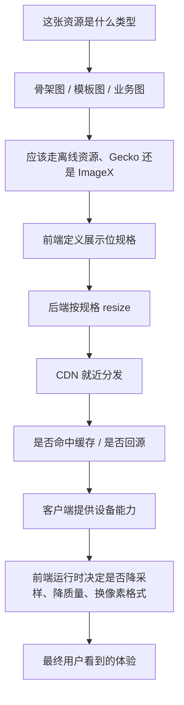

最近在做一个 Lynx 集卡活动页时，我发现“图片该怎么放”这件事，表面上像个资源管理问题，实际上会一路牵扯到页面首屏、运营换图、调试效率、低端机稳定性、前后端接口设计，甚至还会影响线上崩溃率。

最容易把这个问题说错的地方在于，很多讨论都会把它简化成一句二选一：

```text
活动图片到底传 ImageX，还是放 Gecko？
```

真实工程里，这个问题通常不是二选一，而是一个分层问题：

```text
哪些资源应该跟模板一起走？
哪些资源应该按业务图来处理？
哪些资源必须离线兜底？
哪些图要按展示位拆尺寸？
哪些图要按机型进一步降级？
```

这篇文章把这套思路完整整理一下，尽量写成一篇能直接拿去落地的实践文档。

## 怎么读这篇文章

这篇文章其实同时解释四层问题：

1. **概念层**：`ImageX`、`CDN`、`Gecko`、`源站`、`机房` 分别是什么。
2. **网络层**：用户请求是怎么从手机走到边缘节点，再走到源站的。
3. **工程层**：为什么同一张图不能全场复用，为什么要按展示位拆规格。
4. **端侧层**：为什么高端机和低端机应该看到“同一张图的不同清晰度”，而不是完全不同的图片策略。

如果你以前没系统看过网络和图片服务，可以直接先看下面这张图。

## 一张总览图：这套系统里到底有哪些角色



这张图里最重要的是三条线：

- `template.js` 这条线偏 `Gecko`
- 业务图片这条线偏 `ImageX + CDN`
- 首屏关键兜底这条线偏离线资源

只要这三条线不混，后面的讨论会简单很多。

## 术语速查表

先把最容易混的词压成一张表。

| 词 | 它更像什么 | 主要职责 | 在活动页里的典型对象 |
| --- | --- | --- | --- |
| `ImageX` | 图片服务 | 处理、压缩、裁剪、输出不同规格图片 | 卡面、奖品图、头像、记录图 |
| `CDN` | 分发网络 | 把内容缓存到离用户更近的位置 | 图片、JS、HTML、静态资源 |
| `Gecko` | 模板/资源包分发通道 | 下发模板、版本、资源包 | `template.js`、页面资源包 |
| `源站` | 内容原始来源 | 存原始文件或处理真实请求 | 对象存储、图片服务源、业务服务 |
| `IDC` | 物理机房 | 真正放服务器的地方 | 业务服务、存储、数据库 |
| `Region` | 更大的地域范围 | 管理多个机房，做区域隔离与容灾 | 华北、华东、新加坡等 |
| `POP / Edge` | 边缘节点 | 靠近用户缓存内容 | CDN 边缘缓存点 |
| `回源` | 网络动作 | 边缘节点没有缓存时去源站取内容 | 首次访问图片时发生 |
| `DPR / pixelRatio` | 终端显示参数 | 把 CSS 像素换成实际请求像素 | 请求 `112x112` 还是 `224x224` |
| `downsampling` | 端侧解码策略 | 用更省内存的方式加载大图 | 中低端机图片渲染 |
| `RGB_565 / ARGB_8888` | 像素格式 | 平衡清晰度与内存 | 低端机更偏 `RGB_565` |

## 先给结论

如果你只想先记住一版最实用的答案，那就是：

```text
固定骨架图 -> 离线资源 / 随模板发布
运营可替换图 -> ImageX
业务内容图 -> ImageX
模板和逻辑分发 -> Gecko
高低端机差异 -> 前端 / 客户端运行时降级
展示位大小 -> 前端定义，后端按位 resize
```

展开一点：

- **Gecko** 更适合承载模板和与模板强耦合的静态资源版本。
- **ImageX** 更适合承载业务图片、奖品图、卡面图、头像、运营替换图这类“图片服务”语义的资源。
- **离线资源** 更适合首屏关键骨架、错误态、加载态、关键动效素材、强依赖本地存在的兜底图。
- **高端机 / 低端机的差异**，不要主要交给后端做，而应该由前端结合客户端能力在运行时做第二层降级。

如果一开始就把这些层次分清楚，后面的很多坑都会少踩一半。

## 为什么它不是“都传大图就行”

很多页面在第一版实现里，都会下意识走一条最省事的路：

```text
所有地方都用同一张大图
  -> 大卡展示能看清
  -> 缩略图也直接复用
  -> 头像、记录页、奖品位也沿用同一个 URL
```

这条路短期很快，长期问题非常多：

- 请求体积大，首屏慢。
- 解码内存高，低端机容易卡顿甚至崩。
- 明明只显示 56x79 的小图，却下载和解码了一张几百 KB 甚至上 MB 的资源。
- 同一张图在不同位置的裁切和清晰度不一定合适。
- 后面一旦想补机型降级，成本会急剧上升。

更稳的做法不是“全部上传小图”，而是：

```text
按展示位拆图
  -> 大卡图
  -> 缩略图
  -> 圆头像
  -> 奖品图
  -> 记录页小图
```

也就是说，应该按**展示位**而不是按“这是不是同一张业务图片”来设计规格。

## 第一层：先分清三种资源

讨论活动页图片时，我现在会先把资源分成三类。

### 1. 跟模板强耦合的资源

这类资源通常包括：

- 首屏主视觉底图
- 弹窗底板
- 抽卡背板
- 翻卡按钮图
- loading / error / placeholder
- 动效 JSON 及其关键贴图

它们的特点是：

- 和布局、动画、文案排版强耦合
- 改一张图往往要一起验证样式和交互
- 一旦丢了，页面骨架就不成立

这类资源更适合：

```text
离线资源
或
随模板一起发布的模板资源
```

原因很简单：它们不是普通“内容图”，而是页面骨架的一部分。

### 2. 运营可替换的皮肤图

比如：

- 某个活动期临时要换的 tab 图
- 某个奖池装饰图
- 某个按钮皮肤
- 某一版品牌联名 Logo

这类资源的特点是：

- 不是业务内容本身
- 但又希望有运营替换空间
- 最好不要每次换图都重新发模板

这类资源适合放在：

```text
后端 visual_assets 配置
  -> 图本身走 ImageX / CDN
  -> 前端拿配置渲染
```

### 3. 业务内容图

比如：

- 卡面图
- 奖品图
- 用户头像
- 记录页图片
- 列表 icon

这类资源最适合走 **ImageX** 这类图片服务体系。因为它们天然需要：

- 多规格裁剪
- 不同尺寸输出
- 不同质量等级
- CDN 分发
- 某些场景下的加密或签名能力

## 为什么这件事会同时变成“网络问题”和“图片问题”

很多时候，前端同学会把活动页图片问题理解成：

```text
这不就是前端渲染一张图吗？
```

但活动页里的图片通常会跨四层：

```text
产品配置层
  -> 运营决定换什么图

服务端接口层
  -> 返回什么图片字段、返回多大图

分发网络层
  -> 图片是否命中缓存，是否需要回源

终端渲染层
  -> 图片是否会在当前设备上高内存解码
```

所以你明明在看一张图，实际排查的是四类问题的叠加。

## 从网络角度看，请求到底是怎么走的

只要系统里用了 CDN，用户请求就不再是“手机直接打到源站机房”。

更常见的是下面这条链路：



这张图非常重要，因为它解释了两个常见误解：

### 误解 1：用了 CDN，就没有源站了

不是。CDN 只是“站在用户和源站中间”。

### 误解 2：用户每次都访问源站

也不是。如果缓存命中，用户根本不会碰到源站。

## 什么是缓存命中，什么是回源

这两个词是所有 CDN 讨论里最基础的词。

### 缓存命中

缓存命中就是：

```text
边缘节点本地已经有这份内容
  -> 直接返回
```

它的好处是：

- 用户更快拿到资源
- 源站压力更小
- 大促或活动高峰更稳

### 回源

回源就是：

```text
边缘节点本地没有
  -> 去上游源站取一份
```

为什么会回源？

- 这个资源是第一次被请求
- 边缘缓存过期了
- 这个节点之前没缓存过这份内容
- 策略上不允许长期缓存

如果你想用一句最形象的话记住它，可以这么理解：

```text
缓存命中 = 仓库门口就有货
回源 = 仓库门口没货，要回总仓调货
```

## 为什么 CDN 不能取代正常机房

这个问题的关键，不是“它们物理上是不是都在机房里”，而是“它们承担的是不是同一个职责”。

答案是：不是。

### 正常机房 / 业务机房更像“真相层”

它们通常负责：

- 真实业务服务
- 数据库
- 对象存储或源站入口
- 图片服务上游
- 权限校验、动态逻辑、库存、用户数据

所以它们解决的是：

```text
内容到底从哪里来
动态请求到底谁来算
真实数据到底放在哪里
```

### CDN 边缘节点更像“配送层”

它们通常负责：

- 就近缓存
- 降低跨地域访问时延
- 降低源站带宽和峰值压力
- 在一定程度上做流量吸收和防护

所以它们解决的是：

```text
内容怎么更快送到用户手上
```

### 一个非常容易记住的比喻

```text
正常机房 / 源站
  = 中央仓库 / 总仓

CDN 边缘节点
  = 各地前置仓 / 配送点
```

你不能说“有了前置仓，就不需要总仓了”。它们在一个完整系统里本来就应该同时存在。

## 第二层：Gecko、ImageX、离线资源分别扮演什么角色

把三种资源分清之后，再看 `Gecko` 和 `ImageX`，角色就清楚多了。

### Gecko 更像“模板分发层”

如果把活动页看成一个完整系统，Gecko 更适合承载：

- `template.js`
- 页面运行时脚本
- 随模板版本走的资源引用
- 热更版本管理

它适合解决的是：

```text
这页的代码和模板怎么发
```

而不是：

```text
这张业务图片应该用什么尺寸和质量
```

### ImageX 更像“图片服务层”

ImageX 更适合承载：

- 卡面
- 奖品图
- 头像
- 记录页小图
- 运营可替换图

它更擅长解决的是：

```text
同一张图如何输出不同规格
如何压缩
如何裁切
如何适配不同终端
```

所以对活动页来说，更合理的理解不是：

```text
Gecko 和 ImageX 选一个
```

而是：

```text
Gecko 发模板
ImageX 发业务图
离线资源兜底骨架
```

## 先把三个词分开：ImageX、CDN、Gecko 不是一回事

很多团队第一次聊这个问题时，最容易把三个东西混成一个概念：

- `ImageX`
- `CDN`
- `Gecko`

如果这三个词不先拆开，后面几乎一定会越聊越乱。

### 1. ImageX 是“图片服务”，不是“模板分发系统”

从火山引擎的公开文档看，veImageX 提供的是一套**图片端到端解决方案**，能力包括：

- 上传
- 托管
- 转码与分发
- 缩放、裁剪、水印、模糊等实时处理
- 加载 SDK、监控和质量数据

也就是说，ImageX 更像下面这个东西：

```text
原始图片
  -> 上传 / 托管
  -> 按参数处理
  -> 输出不同规格 URL
  -> 通过 CDN 分发给终端
```

它主要解决的是：

```text
图片如何存
图片如何处理
图片如何按规格输出
图片如何高效分发
```

而不是：

```text
页面模板和脚本如何热更
```

所以在活动页里，ImageX 最适合负责：

- 卡面图
- 奖品图
- 头像
- 记录图
- 运营可替换的视觉图

### 2. CDN 是“内容分发网络”，不是“图片业务本身”

CDN 的核心目标很简单：**把内容更快、更稳定地送到离用户更近的地方。**

从 Cloudflare 和 CloudFront 的公开文档看，CDN 的典型工作方式是：

```text
用户请求
  -> 先到离用户最近的边缘节点 / POP
  -> 节点本地有缓存就直接返回
  -> 没缓存就回源到上游
  -> 取回后再缓存并返回给用户
```

所以 CDN 更像：

```text
分发层 / 缓存层 / 反向代理层
```

它不是图片内容本身，也不是业务模板本身，而是一个“把内容送出去”的网络层。

### 3. Gecko 更像“资源模板分发通道”

在你这个 Lynx 页面里，`Gecko` 更像模板和资源包的分发通道。你在代码里能看到大量这种形式的模板地址：

```text
...sourcecdn.bytegecko.com/.../template.js
```

它更像是在解决：

```text
Lynx 的 template.js 怎么发布
热更新版本怎么下发
模板资源怎么按 channel / version 管理
```

这和 ImageX 处理业务图片，不是同一层职责。

所以一句话总结这三个词：

```text
ImageX = 图片服务
CDN = 分发网络
Gecko = 模板 / 资源包分发通道
```

它们可以协作，但不是互相替代的关系。

## CDN、源站、正常机房、边缘节点，到底是什么关系

这是最容易让人脑子打结的一块。

很多人第一次接触时，会把“正常机房”和“CDN 机房”想成二选一：

```text
有了 CDN，是不是就不需要正常机房了？
```

不是。

更准确的理解应该是：

```text
正常机房 / 源站机房
  负责真正存放原始内容，或者处理业务请求

CDN 边缘节点
  负责把内容缓存到更靠近用户的位置，加速访问
```

### 一张最简单的关系图

```text
用户
  -> 就近 CDN 边缘节点（POP）
  -> 边缘节点没缓存时，回源到源站
  -> 源站可能在一个或多个业务机房
```

如果展开一点，会更像这样：

```text
用户
  -> CDN POP / Edge
  -> 区域缓存（有些 CDN 会有）
  -> 源站 / 对象存储 / 业务服务
  -> 源站所在的业务机房或存储机房
```

### 什么是源站

“源站”不是一个很神秘的东西，它就是：

- 真正存放原始文件的地方
- 或者最终能生成响应的服务

对于图片来说，源站可能是：

- 对象存储
- 图片服务的原始存储层
- 某个业务服务器

对于模板来说，源站可能是：

- 模板资源存储
- 资源包发布系统

所以“源站”是一个职责概念，不一定等于你脑海里的“某一台业务机器”。

### 什么是正常机房

你说的“正常机房”，更准确地说通常是**业务部署机房 / 源站所在机房**。

这类机房里通常承载：

- 业务服务
- 数据库
- 对象存储访问入口
- 源站系统

它们负责的是：

```text
内容真正存在这里
请求 miss 时最终要回到这里
动态业务逻辑也在这里跑
```

### 什么是 CDN 机房

很多 CDN 也会说自己有“很多机房”或“很多节点”。这里更准确的叫法通常是：

- 边缘节点
- POP
- Edge location
- 边缘数据中心

这些位置离用户更近，职责不是存原始真相，而是：

- 缓存热点内容
- 减少源站压力
- 缩短访问时延
- 扛流量峰值

所以：

```text
业务机房解决“内容从哪里来”
CDN 节点解决“内容怎么更快到用户那里”
```

### 那“两个机房”通常有哪几种可能

你说“两个机房都建在……它们什么关系”，在真实系统里常见有三种完全不同的含义。

#### 情况 1：两个业务机房

这通常是为了：

- 容灾
- 高可用
- 流量分担

比如：

```text
机房 A 掉了
  -> 机房 B 还能接
```

这解决的是业务连续性问题。

#### 情况 2：一个业务机房 + 很多 CDN 边缘节点

这通常是为了：

- 用户就近访问
- 加速静态资源
- 降低源站回源压力

这解决的是访问性能问题。

#### 情况 3：多个业务机房 + 很多 CDN 节点

这是更完整也更常见的大规模形态：

```text
多个源站机房
  + 多个 CDN 边缘节点
```

前者负责稳定和容灾，后者负责分发和性能。

这两层不是竞争关系，而是叠加关系。

## 再往下一层：Region、IDC、CDN 节点不是同一件事

在很多大公司内部，通常还会再把“位置”分成几层。

以通用概念来说：

- **Region**：地域大区
- **IDC**：物理机房
- **CDN POP / Edge**：边缘分发节点

一个很容易记的方式是：

```text
Region = 更大的地理范围
IDC = 真正放服务器的物理机房
CDN POP = 靠近用户的边缘缓存节点
```

它们不是同义词。

很多人会把“边缘节点也是机房，所以是不是跟 IDC 一样”。从“物理上也有服务器”这个层面说，它当然也落在某个数据中心里；但从系统职责上，它和业务 IDC 完全不是一类东西。

业务 IDC 更接近：

```text
源站真相层
```

CDN POP 更接近：

```text
靠近用户的分发层
```

## 映射回 Lynx 集卡页：你这条链路里它们分别在干什么

如果把你这次 Lynx 集卡页的真实链路抽象出来，大概是这样：

```text
Lynx 页面代码 / template.js
  -> 通过 Gecko / sourcecdn 这类资源分发域发布

卡面、奖品图、头像、记录图
  -> 通过 ImageX / 图片服务体系按规格输出
  -> 再通过 CDN 分发

首屏关键兜底图 / 骨架图
  -> 直接随包离线资源
```

这三层协作起来，才是完整系统。

### 1. 为什么模板更像走 Gecko

模板的目标是：

- 版本一致
- 热更新
- 渠道化管理
- 代码和资源包联动

所以像 `template.js` 这类资源，更像模板分发问题，而不是图片处理问题。

### 2. 为什么卡面和奖品图更像走 ImageX

卡面和奖品图需要：

- 大图、小图、圆图、记录图不同规格
- 按展示位 resize
- 高中低端机进一步降级
- 有时还要加签、加密或做监控

这套诉求明显是图片服务问题，不是模板分发问题。

### 3. 为什么骨架图最好离线

首屏主视觉、错误态、loading、关键弹窗底板如果完全依赖远端图，一旦远端资源 miss、重写、404 或调试链路出问题，页面骨架就会崩。

所以它们更适合：

```text
本地离线
或
至少有强离线 fallback
```

## 为什么你会觉得“CDN 应该有单独机房，但也应该有正常机房”

这个直觉其实是对的，只是词还没完全分清。

你可以把它理解成：

```text
正常机房 / 源站机房：
  真正存东西，处理真实业务

CDN 边缘节点：
  把这些东西复制 / 缓存 / 加速到更靠近用户的地方
```

所以一个成熟系统常常同时拥有：

- 正常业务机房
- 多个源站部署点
- CDN 分发网络

不是“有 CDN 就没有机房”，而是：

```text
机房负责真实供给
CDN 负责高效配送
```

## 一个更准确的脑图

如果你要把这几个词真正记住，我建议记下面这张脑图：

```text
业务图片
  -> 先进入 ImageX 这样的图片服务
  -> 由图片服务生成不同规格
  -> 再通过 CDN 分发给用户

页面模板
  -> 通过 Gecko / 资源分发系统下发

离线资源
  -> 直接跟包或模板走，做首屏和异常兜底

源站 / 业务机房
  -> 提供原始资源和业务真相

CDN 边缘节点
  -> 负责就近缓存和加速访问
```

只要这张图在脑子里，后面再看“为什么这张图该走 ImageX、那张图该离线、template.js 为什么在 sourcecdn 上”，就不会再混。

## 再往下拆：Region、IDC、POP 到底差在哪

很多时候大家会把“机房”“边缘节点”“区域”统称成“反正都是服务器所在的地方”。从物理视角看，这么说不完全错；但从系统设计上看，这三层职责不同。



### `Region`

更大的地理或逻辑范围。常见理解是“华北”“华东”“新加坡”“美东”这种层级。

### `IDC`

真正的物理机房，服务器实际放在这里。业务服务、数据库、对象存储、源站服务往往都部署在这里。

### `POP / Edge`

更靠近用户的边缘分发节点，用来做缓存和快速返回内容。

所以别把它们理解成同一个概念：

- `Region` 更像区域层
- `IDC` 更像业务和源站的物理层
- `POP` 更像分发层

## Anycast、就近接入、最近节点，到底是不是“最近机房”

通常不是“地图上最近的那个业务机房”，而是“当前网络条件下最适合服务你的那个边缘节点”。

很多 CDN 会使用 Anycast 或类似的全局调度方式。它的直观效果是：

```text
同一个域名 / IP
  -> 不同地区用户会被路由到不同的接入点
```

用户感觉像是在访问“同一个地址”，但网络层实际上把他送到了更合适的边缘节点。

这就是为什么有时你会看到：

- 用户在北京
- 实际请求先进了一个华北边缘节点
- 边缘节点 miss 后再去更后的区域缓存或源站

所以“离用户近”并不是一句很模糊的话，它在网络层通常就是通过路由和调度实现的。

## 静态内容和动态内容为什么处理方式不一样

这是理解 CDN 的另一个关键点。

### 静态内容

比如：

- 图片
- JS
- CSS
- HTML 模板

这类内容对很多用户来说是相同的，所以特别适合缓存。

### 动态内容

比如：

- 用户资产
- 登录态校验
- 库存、抽奖、领奖
- 个性化结果

这类内容通常带用户态或实时性要求，不能简单长时间缓存。

所以一个完整的活动页实际上往往是：

```text
静态资源走 CDN 加速
动态业务走业务服务计算
```

你在前端看到的是“一个页面”，但在网络和服务层面，它往往是“静态链路 + 动态链路”的组合。

## 第三层：大图传大图，小图传小图，到底是谁来定义

这里最容易出现责任边界不清的问题。

我现在更推荐的分工是：

### 前端定义展示位规格

前端最清楚页面怎么显示，所以应该由前端定义：

- 卡面大图显示位多大
- 缩略图显示位多大
- 圆头像显示位多大
- 奖品图显示位多大
- 记录页图显示位多大

本质上，前端定义的是一张“规格表”：

```text
card: 310 x 444
square: 112 x 112
round: 54 x 54
prize: 112 x 112
record: 56 x 79
```

真实项目里，这张表通常还要乘上当前设备的 `pixelRatio`，变成请求尺寸。

### 后端根据规格表做 resize

后端不应该自己猜“这个页面大概想要多大图”，而应该接收前端传来的展示位宽高，再生成相应的图片 URL。

也就是说，后端应该做的是：

```text
收到 card_image_width / card_image_height
  -> 返回 resize 后的卡面图 URL

收到 square_image_width / square_image_height
  -> 返回 resize 后的缩略图 URL

收到 record_image_width / record_image_height
  -> 返回 resize 后的记录页图 URL
```

这种做法的好处是：

- 前端掌握展示需求
- 后端掌握图片服务
- 规格变化时，两边边界清楚

## 第四层：高端机和低端机是不是应该不一样

答案是：**应该不一样，但主要不是后端直接分流，而是前端 / 客户端在运行时做第二层降级。**

原因有两个。

### 1. 低端机的问题不只是流量，而是解码内存

很多人说到图片优化，第一反应是省带宽。但在活动页里，低端机更危险的其实是：

- 图片解码内存
- GPU 压力
- 列表和弹窗同时存在时的峰值内存
- 多图动画或切换时的抖动

所以高低端机差异不应该只理解成：

```text
低端机网差，给它小图
```

更准确的理解是：

```text
低端机更容易被大图解码拖垮
```

这里可以再补一个很容易被忽视的点：

```text
下载体积
!=
解码体积
```

一张压缩后的图片文件可能只有几百 KB，但一旦在内存里按位图解码展开，体积会大很多。

举个非常粗糙但好记的例子：

```text
1080 x 1920 的 ARGB_8888 位图
≈ 1080 * 1920 * 4 bytes
≈ 7.9 MB
```

如果页面里同时出现多张大图、弹窗背景、卡面轮播和奖品图，峰值内存就会很快上来。

所以低端机优化不只是“省流量”，更多是在做：

- 降低解码后内存
- 降低瞬时峰值
- 降低 GPU 上传压力
- 降低大图切换抖动

### 2. 设备能力最准确的信息在客户端

高端机还是低端机，不应该靠后端拍脑袋判断。客户端通常能更直接拿到：

- device score
- 是否 32 位
- 操作系统
- 内存告警

因此更稳的分工是：

```text
后端先按展示位给基础规格图
前端 / 客户端再按设备等级做二次降级
```

## 运行时降级应该怎么做

我更推荐的降级思路是这样的：

```text
High:
  保持原规格
  保持高质量
  用 ARGB_8888

Medium:
  适度缩小
  适度降质量
  仍保留较好视觉效果

Low:
  明显缩小
  明显降质量
  用 RGB_565
  开 downsampling
```

如果你以前没接触过 `RGB_565` 和 `ARGB_8888`，可以先粗略理解成：

- `ARGB_8888`：更清晰、颜色信息更完整，但更占内存
- `RGB_565`：更省内存，但画质会更保守

它们不是“谁先进谁落后”的关系，而是不同场景下的取舍。

### 一个端侧视角的图



这张图想表达的核心不是“低端机体验差一点”，而是：

```text
用同一套业务资源语义
按设备能力选择不同的渲染成本
```

这样既能保证高端机体验，也不至于让低端机在大图页面上容易炸。

换句话说，应该先有一张“逻辑同图”的基础图，再在运行时做“同图降级”，而不是对低端机强行切成另一套完全不同的业务资源。

这套思路有两个好处：

- 前端逻辑简单，不会变成大规模机型 if/else。
- 不会让高低端机看到不同语义的图片，只是清晰度和尺寸不同。

## 那后端需不需要知道高低端机

通常不需要作为主逻辑。

我更推荐的边界是：

- **后端负责展示位尺寸 resize**
- **前端 / 客户端负责设备等级降级**

如果把“高端机 / 低端机”也做成后端策略，容易出现两个问题：

### 1. 双重缩图

后端已经按设备降了一轮，前端又按设备降一轮，最后效果会过度模糊。

### 2. 责任边界变乱

一旦线上某张图模糊，大家很难判断：

```text
是前端请求尺寸错了？
是后端 resize 过头了？
是客户端运行时又降了一轮？
```

所以除非有特别强的服务端设备信息和统一策略，否则设备等级最好不要放在后端做第一责任人。

## 前端、后端、客户端分别该做什么

这是整件事里最值得提前说清楚的一块。

### 前端负责什么

前端最应该负责的是四件事：

1. 定义展示位规格
2. 请求对应尺寸参数
3. 决定当前场景使用哪类图
4. 在运行时做机型降级和兜底

更具体一点：

- 大卡看卡面大图
- 图鉴看缩略图
- 头像看圆图
- 记录页看小图
- 低端机打开 `downsampling`
- 特定场景切 `RGB_565`
- 加 placeholder、binderror、preload

### 后端负责什么

后端最应该负责的是四件事：

1. 接收展示位宽高参数
2. 对图片 URL 做 resize
3. 提供稳定的 `visual_assets` 配置结构
4. 返回字段语义清楚的图片位

比如：

- `front_image_url`
- `back_image_url`
- `square_image_url`
- `round_image_url`
- `prize_thumb_url`

而不是只返回一个模糊的：

```text
image_url
```

如果后端把图片字段设计得太模糊，前端通常会面临三个问题：

- 不知道该用它做大图、缩略图还是头像
- 同一个字段被多个场景错误复用
- 后续很难在不改协议的情况下细化图片策略

所以协议层的“字段语义清晰”本身就是一种长期优化能力。

### 客户端负责什么

客户端最应该负责的是三件事：

1. 提供设备能力信息
2. 执行图片解码层优化
3. 提供预加载和缓存能力

比如：

- `readingGetDeviceStats`
- `downsampling`
- `image-config`
- `preloadImage`

这部分能力如果没有，前端再会写策略也很难真正把内存压下来。

## 一个很容易踩的坑：本地模板不等于本地静态图

做活动页调试时，还有一个特别容易让人误判的问题：

```text
template.js 是本地的
!=
图片资源一定也是本地的
```

很多移动端调试链路里，模板可能来自本地 dev server，但图片 URL 仍然可能被改写成离线包或 CDN 路径。

于是你看到的现象会变成：

- 页面逻辑看起来是最新的
- 但图片 404
- 触发 placeholder / binderror
- 最后误以为是布局或渲染问题

所以做这类排查时，一定要把这几件事拆开看：

```text
模板是否本地
图片实际请求的 URL 是什么
图片是否被重写
失败后是否走了 placeholder 或 binderror
```

如果不把“模板链路”和“图片链路”分开，很容易浪费很多时间。

## 如果把这些知识点再压成一张工程脑图

到这里，其实你已经可以把这套问题拆成九个连续问题：



这张图最大的意义，是把“图片能不能显示”拆成了一整条工程链路。

当你下次遇到问题时，就不会只盯着某一个 `src` 或某一个 `<image>` 组件，而是会知道自己在排查哪一层：

- 是资源层？
- 是协议层？
- 是网络分发层？
- 是端侧渲染层？

## 一套更稳的活动页图片实践

如果我要从零搭一套 Lynx 活动页图片体系，我会直接按下面这套规则来。

### 资源分层

```text
离线资源：
  主骨架、错误态、加载态、关键动效素材

Gecko：
  模板、脚本、与模板版本绑定的资源引用

ImageX：
  卡面、奖品图、头像、记录图、运营皮肤图
```

### 尺寸策略

```text
按展示位定义规格
  -> card
  -> square
  -> round
  -> prize
  -> record

请求尺寸 = CSS 尺寸 * DPR
```

### 设备策略

```text
High:
  高质量 + 原规格

Medium:
  中等质量 + 中等缩放

Low:
  更低质量 + 更小尺寸 + RGB_565 + downsampling
```

### 兜底策略

```text
首屏关键图要有离线 fallback
业务图要有 binderror / placeholder
不要让纯远端图决定页面骨架是否成立
```

## 最后给一份检查清单

如果你也在做 Lynx 活动页，可以直接拿这份清单过一遍：

- 这张图是骨架图，还是业务图？
- 它应该走离线资源、Gecko，还是 ImageX？
- 这张图有没有明确的展示位规格？
- 有没有和别的位置错误复用同一张大图？
- 后端是否支持按位 resize？
- 前端是否按 DPR 请求了尺寸？
- 是否有高 / 中 / 低端机分级？
- 低端机场景有没有 `downsampling` 和更保守的 `image-config`？
- 首屏关键资源是否有离线 fallback？
- 模板和图片链路是否分开验证过？

如果这些问题里有三四个答不上来，活动页大概率还会在后续联调或线上阶段继续出问题。

## 这篇文章真正想帮你建立的，不只是“答案”，而是判断顺序

很多活动页问题之所以难，不是因为技术太深，而是因为大家一上来就在抢答案：

```text
是不是都走 ImageX？
是不是都放 Gecko？
是不是 CDN 出问题了？
是不是低端机不行？
```

更有效的顺序其实是：

1. 先分资源类型
2. 再定展示位规格
3. 再看网络分发链路
4. 再看设备等级和端侧渲染
5. 最后才看具体代码实现

顺序对了，很多问题都会自然变清楚。

## 结语

活动页图片体系看起来像个很“小”的工程问题，但它其实很适合作为一次团队工程能力的缩影。

做得粗糙时，它会表现成：

```text
图片能显示就行
先都传大图
先都走一个 URL
低端机有问题再说
```

做得成熟时，它会表现成：

```text
资源先分层
图片按展示位拆规格
后端按位 resize
前端按设备降级
客户端兜底解码和预加载
骨架图和业务图分开治理
```

这两种做法短期都能把页面做出来，但长期差距会越来越大。

前者靠的是“先跑起来”，后者靠的是“以后还能继续改，而且不容易炸”。

如果你正在做的是带大量图片、动效、运营换皮和低端机压力的活动页，我会更推荐后一种。

## 延伸阅读

如果你想把本文里的几个概念再往下追，下面这些公开资料很适合继续看：

- [火山引擎 veImageX 功能特性](https://www.volcengine.com/docs/508/105005)
- [火山引擎 veImageX 图片加载 SDK 简介](https://www.volcengine.com/docs/508/65964)
- [Cloudflare: What is a CDN?](https://www.cloudflare.com/learning/cdn/what-is-a-cdn/)
- [Cloudflare: What is an origin server?](https://www.cloudflare.com/learning/cdn/glossary/origin-server/)
- [Amazon CloudFront: How CloudFront works](https://docs.aws.amazon.com/AmazonCloudFront/latest/DeveloperGuide/HowCloudFrontWorks.html)

这些资料解决的是“概念层面是什么”；而本文更偏“放到 Lynx 活动页里应该怎么做”。
